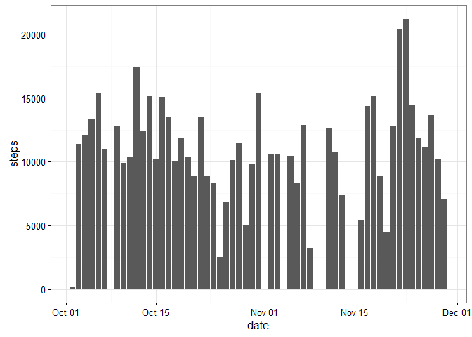
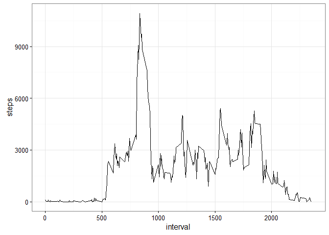

# Reproducible Research - Course Project 1
Mathias Stein  


## Total number of steps taken per day


```r
activity <- read.csv("activity.csv", sep = ",")
merged_by_day <- activity[which(activity$steps >= 0), ]
merged_by_day <- merged_by_day %>% group_by(date) %>% summarise(steps = sum(steps))
merged_by_day <- as.data.frame(merged_by_day)
merged_by_day$date <- as.Date(merged_by_day$date)

ggplot(merged_by_day, aes(x = date, y = steps)) + 
  geom_bar(stat = "identity") +
  theme_bw()
```

<!-- -->

Mean of the total number of steps taken per day :


```
## [1] 10766.19
```

Median of the total number of steps taken per day :


```
## [1] 10765
```

## Average daily activity pattern


```r
activity <- read.csv("activity.csv", sep = ",")
merged_by_interval <- activity[which(activity$steps >= 0), ]
merged_by_interval <- merged_by_interval %>% group_by(interval) %>% summarise(steps = sum(steps))
merged_by_interval <- as.data.frame(merged_by_interval)
merged_by_interval <- merged_by_interval[which(merged_by_interval$steps >= 0), ]

ggplot(merged_by_interval, aes(x = interval, y = steps)) + 
  geom_line() +
  theme_bw()
```

<!-- -->

The 5-minute interval, on average across all the days in the dataset, which contains the maximum number of steps is :


```
## [1] 835
```

## Imputing missing values

Total number of missing values in the dataset


```
## [1] 2304
```

Those missing values will be filled by the mean for the 5-minute interval for all the data collected. Here is the code :


```r
activity <- read.csv("activity.csv", sep = ",")
clean_activity <- activity

for (i in which(sapply(clean_activity, is.numeric))) {
    for (j in which(is.na(clean_activity[, i]))) {
        clean_activity[j, i] <- mean(clean_activity[clean_activity[, "interval"] == clean_activity[j, "interval"], i],  na.rm = TRUE)
    }
}
```

Here is the new histogram with missing values replaced by mean :

<!-- -->

New Mean of the total number of steps taken per day :


```
## [1] 10766.19
```

New Median of the total number of steps taken per day :


```
## [1] 10765
```

We can see that both histogram are the same. Inputting values based on the mean will necessarly produce the same mean.

## Differences in activity patterns between weekdays and weekends


```r
clean_activity$date <- as.Date(clean_activity$date)
clean_activity$week = ifelse(weekdays(clean_activity$date) == "Saturday" | weekdays(clean_activity$date) == "Sunday", "weekend", "weekday")
clean_activity$week = as.factor(clean_activity$week)
merged_by_interval <- clean_activity %>% group_by(interval, week) %>% summarise(steps = sum(steps))
merged_by_interval <- as.data.frame(merged_by_interval)
xyplot(steps ~ interval | week, data = merged_by_interval, layout = c(1,2), type = "l")
```

<!-- -->
